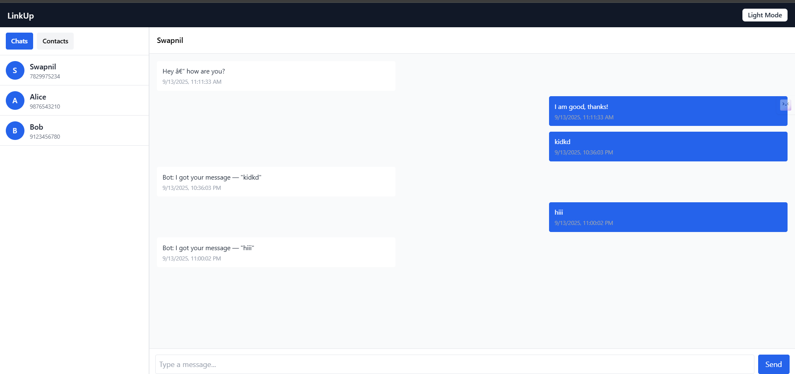

# 💬 MERN + PostgreSQL Messaging App

A WhatsApp-style real-time messaging application built with the **MERN stack (MongoDB, Express, React, Node.js)** combined with **PostgreSQL** for structured data storage.  
The app features **real-time chat with Socket.IO**, **contact management**, **dark/light mode toggle**, and a clean **WhatsApp-inspired UI**.

---

## 🚀 Features
- 🔐 **User-friendly Contacts Manager** – add and view contacts.
- 💬 **Real-time Messaging** – powered by **Socket.IO**.
- 🌙 **Dark/Light Mode Toggle** for modern UX.
- 🖼️ **Customizable Background** (add your own local images).
- 📱 **Responsive UI** – optimized for both desktop and mobile.

---

## 📷 Preview


---

## 🛠️ Tech Stack
**Frontend:**
- React (Vite + JSX)
- Tailwind CSS
- Axios
- Socket.IO Client

**Backend:**
- Node.js + Express.js
- PostgreSQL (via `pg` library)
- Socket.IO Server
- CORS enabled for cross-origin requests

---

## ⚡ Installation & Setup

### 1. Clone Repository
```bash
git clone https://github.com/your-username/messaging-app.git
cd messaging-app
````

### 2. Setup Backend

```bash
cd backend
npm install
```

* Configure **PostgreSQL** credentials in `.env`:

  ```env
  PORT=4000
  PGUSER=your_user
  PGPASSWORD=your_password
  PGHOST=localhost
  PGDATABASE=messaging_app
  PGPORT=5432
  ```
* Run migrations (ensure `contacts` and `messages` tables exist).
* Start backend:

  ```bash
  npm run dev
  ```

### 3. Setup Frontend

```bash
cd frontend
npm install
```

* Configure `.env` in `frontend/`:

  ```env
  VITE_API_BASE=http://localhost:4000/api
  VITE_SOCKET_URL=http://localhost:4000
  ```
* Start frontend:

  ```bash
  npm run dev
  ```

---

## 🗂️ Project Structure

```
messaging-app/
│── backend/          # Express + PostgreSQL backend
│   ├── routes/       # API routes (contacts, messages)
│   ├── db.js         # Database connection
│   └── server.js     # Main backend server
│
│── frontend/         # React + Vite frontend
│   ├── src/
│   │   ├── components/  # UI Components
│   │   ├── services/    # API requests
│   │   └── App.jsx      # Main React app
│   └── public/          # Static files (add preview.png or bg-chat.jpg here)
│
└── README.md
```

---

## 🌟 Future Enhancements

* ✅ Authentication (JWT-based login/register).
* ✅ Group chats.
* ✅ File/image sharing.
* ✅ Notifications.

---

## 👨‍💻 Author

💼 GitHub: swapnil77122
📧 Email: swapnildhage7885@gmail.com

---

```
